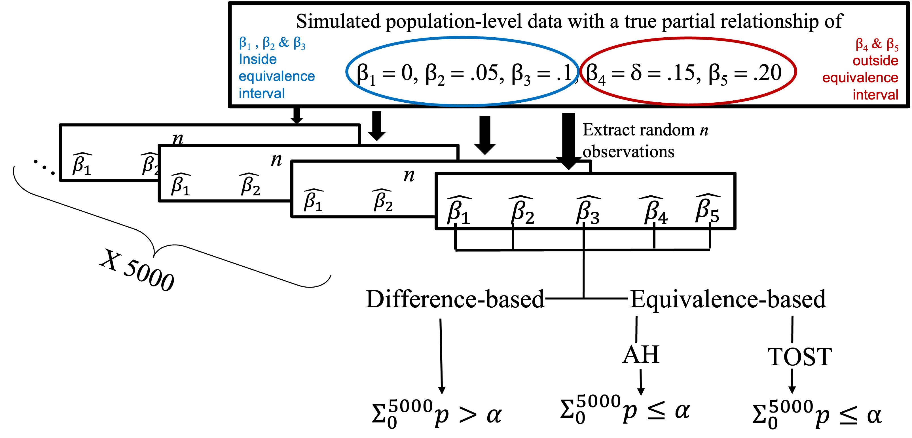

```{r setup, include=FALSE}
library(flexdashboard)
library(magrittr)
library(simglm)
library(tidyverse)
library(haven)
library(hrbrthemes)
library(plotly)
library(greekLetters)
library(MetBrewer)
library(datapasta)
library(DT)

```

```{r initial data, include=FALSE}

simresults <- readxl::read_xlsx("simulation results.xlsx", col_names = TRUE)


simresults$approach <- factor(simresults$approach, levels = c("difference based", "equivalence based"), ordered = FALSE)
simresults$`test type` <- factor(simresults$`test type`, levels = c("DB", "TOST", "AH"), ordered = TRUE)
simresults$predictor <- factor(simresults$predictor, levels = c(1, 2, 3, 4, 5), ordered = TRUE)
simresults$`effect size` <- factor(simresults$`effect size`, levels = c(0, 0.05, 0.1, 0.15, 0.2), ordered = TRUE)
simresults$`sample size` <- factor(simresults$`sample size`, levels = c(50, 75, 100, 250, 500, 1000), ordered = TRUE)

str(simresults)

correctLOA <- subset(simresults, simresults$`effect size` != "0.15" & simresults$`effect size` != "0.2") 
incorrectLOA <- subset(simresults, simresults$`effect size` == 0.15 | simresults$`effect size` == 0.2) 

correctLOA <- correctLOA %>% 
  rename(
    es = `effect size`,
    ss = `sample size`
    )

incorrectLOA <- incorrectLOA %>% 
  rename(
    es = `effect size`,
    ss = `sample size`
    )

str(correctLOA)

rawdat <- tibble::tribble(
            ~approach, ~test.type, ~predictor, ~effect.size, ~sample.size, ~LOA.conclusion.rate,
   "difference based",       "DB",         1L,            0,          50L,               0.9502,
   "difference based",       "DB",         1L,            0,          75L,                 0.95,
   "difference based",       "DB",         1L,            0,         100L,               0.9476,
   "difference based",       "DB",         1L,            0,         250L,               0.9472,
   "difference based",       "DB",         1L,            0,         500L,               0.9458,
   "difference based",       "DB",         1L,            0,        1000L,               0.9506,
   "difference based",       "DB",         2L,         0.05,          50L,               0.9384,
   "difference based",       "DB",         2L,         0.05,          75L,               0.9328,
   "difference based",       "DB",         2L,         0.05,         100L,               0.9222,
   "difference based",       "DB",         2L,         0.05,         250L,               0.8794,
   "difference based",       "DB",         2L,         0.05,         500L,               0.8004,
   "difference based",       "DB",         2L,         0.05,        1000L,                0.654,
   "difference based",       "DB",         3L,          0.1,          50L,               0.9006,
   "difference based",       "DB",         3L,          0.1,          75L,               0.8726,
   "difference based",       "DB",         3L,          0.1,         100L,               0.8426,
   "difference based",       "DB",         3L,          0.1,         250L,               0.6588,
   "difference based",       "DB",         3L,          0.1,         500L,               0.3944,
   "difference based",       "DB",         3L,          0.1,        1000L,               0.1118,
   "difference based",       "DB",         4L,         0.15,          50L,                0.844,
   "difference based",       "DB",         4L,         0.15,          75L,               0.7602,
   "difference based",       "DB",         4L,         0.15,         100L,               0.7022,
   "difference based",       "DB",         4L,         0.15,         250L,               0.3604,
   "difference based",       "DB",         4L,         0.15,         500L,               0.0872,
   "difference based",       "DB",         4L,         0.15,        1000L,               0.0024,
   "difference based",       "DB",         5L,          0.2,          50L,               0.7392,
   "difference based",       "DB",         5L,          0.2,          75L,               0.6236,
   "difference based",       "DB",         5L,          0.2,         100L,               0.5038,
   "difference based",       "DB",         5L,          0.2,         250L,                0.121,
   "difference based",       "DB",         5L,          0.2,         500L,                0.008,
   "difference based",       "DB",         5L,          0.2,        1000L,                    0,
  "equivalence based",     "TOST",         1L,            0,          50L,                    0,
  "equivalence based",     "TOST",         1L,            0,          75L,                4e-04,
  "equivalence based",     "TOST",         1L,            0,         100L,               0.0052,
  "equivalence based",     "TOST",         1L,            0,         250L,               0.5116,
  "equivalence based",     "TOST",         1L,            0,         500L,               0.9042,
  "equivalence based",     "TOST",         1L,            0,        1000L,               0.9984,
  "equivalence based",     "TOST",         2L,         0.05,          50L,                    0,
  "equivalence based",     "TOST",         2L,         0.05,          75L,                2e-04,
  "equivalence based",     "TOST",         2L,         0.05,         100L,               0.0048,
  "equivalence based",     "TOST",         2L,         0.05,         250L,               0.3936,
  "equivalence based",     "TOST",         2L,         0.05,         500L,               0.7126,
  "equivalence based",     "TOST",         2L,         0.05,        1000L,               0.9338,
  "equivalence based",     "TOST",         3L,          0.1,          50L,                    0,
  "equivalence based",     "TOST",         3L,          0.1,          75L,                2e-04,
  "equivalence based",     "TOST",         3L,          0.1,         100L,               0.0016,
  "equivalence based",     "TOST",         3L,          0.1,         250L,                0.194,
  "equivalence based",     "TOST",         3L,          0.1,         500L,               0.2972,
  "equivalence based",     "TOST",         3L,          0.1,        1000L,                 0.47,
  "equivalence based",     "TOST",         4L,         0.15,          50L,                    0,
  "equivalence based",     "TOST",         4L,         0.15,          75L,                8e-04,
  "equivalence based",     "TOST",         4L,         0.15,         100L,               0.0014,
  "equivalence based",     "TOST",         4L,         0.15,         250L,               0.0492,
  "equivalence based",     "TOST",         4L,         0.15,         500L,               0.0476,
  "equivalence based",     "TOST",         4L,         0.15,        1000L,                0.047,
  "equivalence based",     "TOST",         5L,          0.2,          50L,                    0,
  "equivalence based",     "TOST",         5L,          0.2,          75L,                    0,
  "equivalence based",     "TOST",         5L,          0.2,         100L,                2e-04,
  "equivalence based",     "TOST",         5L,          0.2,         250L,                0.011,
  "equivalence based",     "TOST",         5L,          0.2,         500L,                0.003,
  "equivalence based",     "TOST",         5L,          0.2,        1000L,                    0,
  "equivalence based",       "AH",         1L,            0,          50L,               0.0834,
  "equivalence based",       "AH",         1L,            0,          75L,               0.1164,
  "equivalence based",       "AH",         1L,            0,         100L,               0.1434,
  "equivalence based",       "AH",         1L,            0,         250L,               0.5208,
  "equivalence based",       "AH",         1L,            0,         500L,               0.9042,
  "equivalence based",       "AH",         1L,            0,        1000L,               0.9984,
  "equivalence based",       "AH",         2L,         0.05,          50L,                0.077,
  "equivalence based",       "AH",         2L,         0.05,          75L,               0.1056,
  "equivalence based",       "AH",         2L,         0.05,         100L,               0.1206,
  "equivalence based",       "AH",         2L,         0.05,         250L,               0.4026,
  "equivalence based",       "AH",         2L,         0.05,         500L,               0.7126,
  "equivalence based",       "AH",         2L,         0.05,        1000L,               0.9338,
  "equivalence based",       "AH",         3L,          0.1,          50L,               0.0686,
  "equivalence based",       "AH",         3L,          0.1,          75L,               0.0754,
  "equivalence based",       "AH",         3L,          0.1,         100L,               0.0898,
  "equivalence based",       "AH",         3L,          0.1,         250L,               0.1996,
  "equivalence based",       "AH",         3L,          0.1,         500L,               0.2972,
  "equivalence based",       "AH",         3L,          0.1,        1000L,                 0.47,
  "equivalence based",       "AH",         4L,         0.15,          50L,                0.054,
  "equivalence based",       "AH",         4L,         0.15,          75L,               0.0552,
  "equivalence based",       "AH",         4L,         0.15,         100L,                0.054,
  "equivalence based",       "AH",         4L,         0.15,         250L,               0.0502,
  "equivalence based",       "AH",         4L,         0.15,         500L,               0.0476,
  "equivalence based",       "AH",         4L,         0.15,        1000L,                0.047,
  "equivalence based",       "AH",         5L,          0.2,          50L,               0.0348,
  "equivalence based",       "AH",         5L,          0.2,          75L,                0.026,
  "equivalence based",       "AH",         5L,          0.2,         100L,               0.0184,
  "equivalence based",       "AH",         5L,          0.2,         250L,                0.012,
  "equivalence based",       "AH",         5L,          0.2,         500L,                0.003,
  "equivalence based",       "AH",         5L,          0.2,        1000L,                    0
  )


```


Column {data-width=650}
-----------------------------------------------------------------------

### Table 3: Simulation Results for Equivalence-Based and Difference-Based Approaches by Sample and Effect Sizes


```{r}

```
Column {data-width=600}
-----------------------------------------------------------------------

### Table 3: Simulation Results for Equivalence-Based and Difference-Based Approaches by Sample and Effect Sizes


```{r}
datatable(rawdat)
```


Column {data-width=350}
-----------------------------------------------------------------------

### Power Rates

```{r}

es.labs <- c('\u03B2 = 0', "\u03B2 = 0.05", "\u03B2 = 0.1")
names(es.labs) <- c("0", "0.05", "0.1")

p <- correctLOA %>%
ggplot(aes(x =ss, y = `LOA conclusion rate`, group = `test type`, color= `test type`, text = colnames(correctLOA))) + geom_line(aes(text= paste("Test: ",`test type`, "\n\u03B2 = ",es, "\nn: ", ss, "\nCorrect Conclusion Rate: ",100*`LOA conclusion rate`,"%", sep = "")  ), alpha= .5,size= 1, position=position_dodge(width=.1))+facet_wrap(~es, labeller = labeller(es= es.labs))+theme_minimal()+labs(y="Rate of Correct Negligible Effect Conclusions", x = "Sample Size")+ scale_color_manual(values=met.brewer("Isfahan1", 3))+theme(axis.text.x = element_text(angle=45,vjust = 1, hjust=1))
                                                                    
ggplotly(p, tooltip = "text")
```

### Error Rates

```{r}

es.labs0 <- c('\u03B2 = 0.15', "\u03B2 = 0.2")
names(es.labs0) <- c("0.15", "0.2")

p0 <- incorrectLOA %>%
ggplot(aes(x =ss, y = `LOA conclusion rate`, group = `test type`, color= `test type`)) + geom_line(aes(text= paste("Test: ",`test type`, "\n\u03B2 = ",es, "\nn: ", ss, "\nIncorrect Conclusion Rate: ",100*`LOA conclusion rate`,"%", sep = "")  ),size= 2, position=position_dodge(width=.1))+facet_wrap(~es, labeller = labeller(es= es.labs0))+theme_minimal()+labs(y="Rate of Incorrect Negligible Effect Conclusions", x = "Sample Size")+ scale_color_manual(values=met.brewer("Isfahan1", 3))+theme(axis.text.x = element_text(angle=45,vjust = 1, hjust=1))
                                                                    
ggplotly(p0, tooltip = "text")
```

