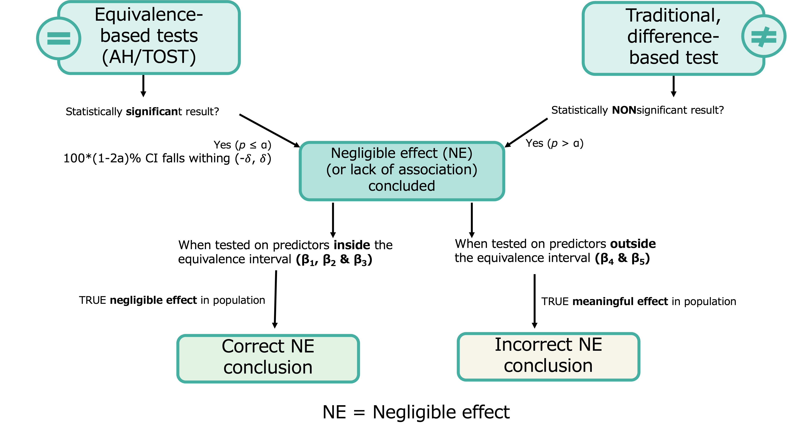

```{r setup, include=FALSE}
library(flexdashboard)
library(magrittr)
library(simglm)
library(tidyverse)
library(haven)
library(hrbrthemes)
library(plotly)
library(greekLetters)
library(MetBrewer)
library(datapasta)
library(DT)

```

```{r initial data, include=FALSE}

simresults <- readxl::read_xlsx("simulation results.xlsx", col_names = TRUE)


simresults$approach <- factor(simresults$approach, levels = c("difference based", "equivalence based"), ordered = FALSE)
simresults$`test type` <- factor(simresults$`test type`, levels = c("DB", "TOST", "AH"), ordered = TRUE)
simresults$predictor <- factor(simresults$predictor, levels = c(1, 2, 3, 4, 5), ordered = TRUE)
simresults$`effect size` <- factor(simresults$`effect size`, levels = c(0, 0.05, 0.1, 0.15, 0.2), ordered = TRUE)
simresults$`sample size` <- factor(simresults$`sample size`, levels = c(50, 75, 100, 250, 500, 1000), ordered = TRUE)

str(simresults)

correctLOA <- subset(simresults, simresults$`effect size` != "0.15" & simresults$`effect size` != "0.2") 
incorrectLOA <- subset(simresults, simresults$`effect size` == 0.15 | simresults$`effect size` == 0.2) 

correctLOA <- correctLOA %>% 
  rename(
    es = `effect size`,
    ss = `sample size`
    )

incorrectLOA <- incorrectLOA %>% 
  rename(
    es = `effect size`,
    ss = `sample size`
    )

```

Paper Highlights {data-icon="fa-highlighter"}
=============================

Inputs {.sidebar}
-------------------------------------

```{r}

```
Column {.tabset data-width=500}
-------------------------------------
   
### Effect Size

```{r}
knitr::include_graphics('effectsize.png')

```   

### Correct Conclusions (Power) vs. Incorrect Conclusions (Error)

```{r}
knitr::include_graphics('table.png')
```   
 
### Simulation Procedure
    
```{r}
knitr::include_graphics('simproc.png')

```

### Conclusion Flowchart
    
```{r}


```

### Simulation Results

```{r}
datatable(simresults)
```


Column {data-width=500}
-----------------------------------------------------------------------

### Power Rates

```{r}

es.labs <- c('\u03B2 = 0', "\u03B2 = 0.05", "\u03B2 = 0.1")
names(es.labs) <- c("0", "0.05", "0.1")

p <- correctLOA %>%
ggplot(aes(x =ss, y = `LOA conclusion rate`, group = `test type`, color= `test type`, text = colnames(correctLOA))) + geom_line(aes(text= paste("Test: ",`test type`, "\n\u03B2 = ",es, "\nn: ", ss, "\nCorrect Conclusion Rate: ",100*`LOA conclusion rate`,"%", sep = "")  ), alpha= .5,size= 1.5, position=position_dodge(width=.1))+facet_wrap(~es, labeller = labeller(es= es.labs))+theme_minimal()+labs(y="Rate of Correct Negligible Effect Conclusions", x = "Sample Size")+ scale_color_manual(values=met.brewer("Isfahan1", 3))+theme(axis.text.x = element_text(angle=45,vjust = 1, hjust=1))
                                                                    
ggplotly(p, tooltip = "text")
```

### Error Rates

```{r}

es.labs0 <- c('\u03B2 = 0.15', "\u03B2 = 0.2")
names(es.labs0) <- c("0.15", "0.2")

p0 <- incorrectLOA %>%
ggplot(aes(x =ss, y = `LOA conclusion rate`, group = `test type`, color= `test type`)) + geom_line(aes(text= paste("Test: ",`test type`, "\n\u03B2 = ",es, "\nn: ", ss, "\nIncorrect Conclusion Rate: ",100*`LOA conclusion rate`,"%", sep = "")  ),alpha= .5,size= 1.5, position=position_dodge(width=.1))+facet_wrap(~es, labeller = labeller(es= es.labs0))+theme_minimal()+labs(y="Rate of Incorrect Negligible Effect Conclusions", x = "Sample Size")+ scale_color_manual(values=met.brewer("Isfahan1", 3))+theme(axis.text.x = element_text(angle=45,vjust = 1, hjust=1))
                                                                    
ggplotly(p0, tooltip = "text")
```


About the Author {data-icon="fa-user-ninja"}
=============================
