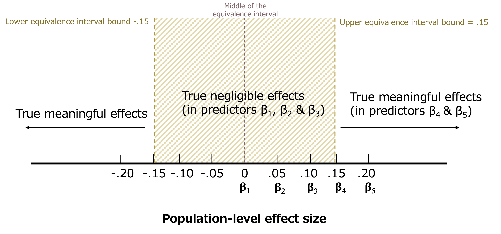
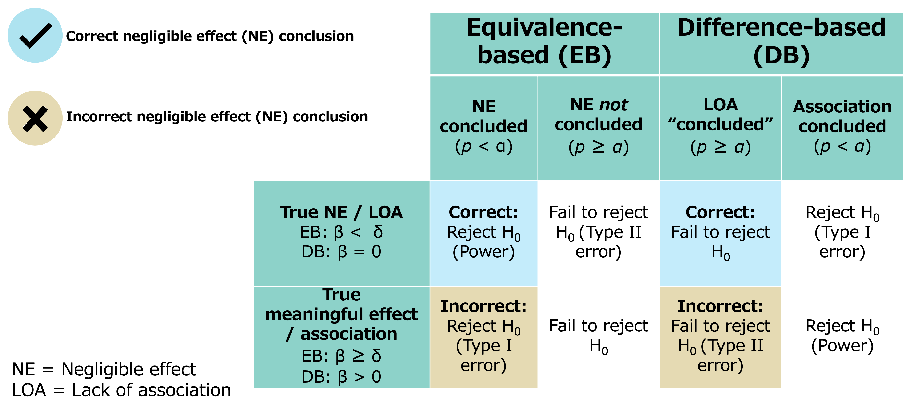
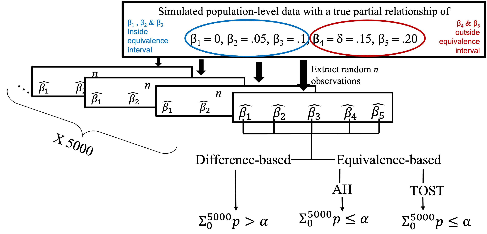
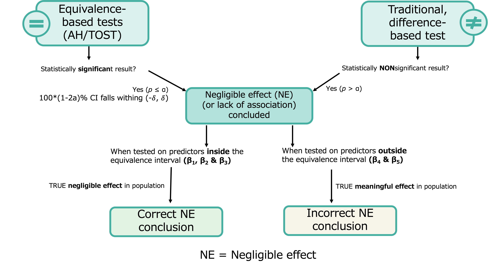

```{r setup, include=FALSE}
library(flexdashboard)
library(magrittr)
library(simglm)
library(tidyverse)
library(haven)
library(hrbrthemes)
library(plotly)
library(greekLetters)
library(MetBrewer)
library(datapasta)
library(DT)

```

```{r initial data, include=FALSE}

simresults <- readxl::read_xlsx("simulation results.xlsx", col_names = TRUE)


simresults$approach <- factor(simresults$approach, levels = c("difference based", "equivalence based"), ordered = FALSE)
simresults$`test type` <- factor(simresults$`test type`, levels = c("DB", "TOST", "AH"), ordered = TRUE)
simresults$predictor <- factor(simresults$predictor, levels = c(1, 2, 3, 4, 5), ordered = TRUE)
simresults$`effect size` <- factor(simresults$`effect size`, levels = c(0, 0.05, 0.1, 0.15, 0.2), ordered = TRUE)
simresults$`sample size` <- factor(simresults$`sample size`, levels = c(50, 75, 100, 250, 500, 1000), ordered = TRUE)

str(simresults)

correctLOA <- subset(simresults, simresults$`effect size` != "0.15" & simresults$`effect size` != "0.2") 
incorrectLOA <- subset(simresults, simresults$`effect size` == 0.15 | simresults$`effect size` == 0.2) 

correctLOA <- correctLOA %>% 
  rename(
    es = `effect size`,
    ss = `sample size`
    )

incorrectLOA <- incorrectLOA %>% 
  rename(
    es = `effect size`,
    ss = `sample size`
    )

```

Paper Highlights {data-icon="fa-highlighter"}
=============================

Inputs {.sidebar data-width=300}
-------------------------------------
<b>Abstract</b>  <br>
Psychological research is rife with inappropriately concluding “no effect” between predictors and outcome in regression models following statistically nonsignificant results. This approach is methodologically flawed, however, because failing to reject the null hypothesis using traditional, difference-based tests does not mean the null is true. Using this approach leads to high rates of incorrect conclusions which floods psychological literature. This study introduces a novel, methodologically sound alternative; we demonstrate how to apply equivalence testing to evaluate whether predictors have negligible effects on the outcome in multiple regression. we constructed a simulation study to evaluate the performance of two equivalence-based methods and compared it to the traditional test. we further developed two R functions which accompany this study to supply researchers with open-access and easy-to-use tools. The use of the proposed equivalence-based methods and R functions is illustrated through examples from the literature, and recommendations for results reporting and interpretations are discussed. For the full paper, R code, functions, slides, and supplemental materials please see https://osf.io/w96xe/ and/or https://github.com/udialter/equivalence-testing-multiple-regression. You can also press the top right "paper" button to be directed to the PsyArxiv preprint.


Column {.tabset data-width=500}
-------------------------------------
   
### Effect Size

```{r}


```   

### Correct Conclusions (Power) vs. Incorrect Conclusions (Error)

```{r}

```   
 
### Simulation Procedure
    
```{r}


```

### Conclusion Flowchart
    
```{r}


```

### Simulation Results

```{r}
datatable(simresults)
```

Column {data-width=500}
-----------------------------------------------------------------------

### Power Rates

```{r}

es.labs <- c('\u03B2 = 0', "\u03B2 = 0.05", "\u03B2 = 0.1")
names(es.labs) <- c("0", "0.05", "0.1")

p <- correctLOA %>%
ggplot(aes(x =ss, y = `LOA conclusion rate`, group = `test type`, color= `test type`, text = colnames(correctLOA))) + geom_line(aes(text= paste("Test: ",`test type`, "\n\u03B2 = ",es, "\nn: ", ss, "\nCorrect Conclusion Rate: ",100*`LOA conclusion rate`,"%", sep = "")  ), alpha= .5,size= 1.5, position=position_dodge(width=.1))+facet_wrap(~es, labeller = labeller(es= es.labs))+theme_minimal()+labs(y="Rate of Correct Negligible Effect Conclusions", x = "Sample Size")+ scale_color_manual(values=met.brewer("Isfahan1", 3))+theme(axis.text.x = element_text(angle=45,vjust = 1, hjust=1))
                                                                    
ggplotly(p, tooltip = "text")
```

### Error Rates

```{r}

es.labs0 <- c('\u03B2 = 0.15', "\u03B2 = 0.2")
names(es.labs0) <- c("0.15", "0.2")

p0 <- incorrectLOA %>%
ggplot(aes(x =ss, y = `LOA conclusion rate`, group = `test type`, color= `test type`)) + geom_line(aes(text= paste("Test: ",`test type`, "\n\u03B2 = ",es, "\nn: ", ss, "\nIncorrect Conclusion Rate: ",100*`LOA conclusion rate`,"%", sep = "")  ),alpha= .5,size= 1.5, position=position_dodge(width=.1))+facet_wrap(~es, labeller = labeller(es= es.labs0))+theme_minimal()+labs(y="Rate of Incorrect Negligible Effect Conclusions", x = "Sample Size")+ scale_color_manual(values=met.brewer("Isfahan1", 3))+theme(axis.text.x = element_text(angle=45,vjust = 1, hjust=1))
                                                                    
ggplotly(p0, tooltip = "text")
```


Contact the Authors {data-icon="fa-user-ninja"}
=============================
<b>Udi Alter</b>  
[udialter@yorku.ca](mailto:udialter@yorku.ca)  
[udialter.com](https://udialter.com/)  
[@UdiAlter](https://twitter.com/UdiAlter)
<br><br>
<b>Alyssa Counsell</b>  
[a.counsell@ryerson.ca](mailto:a.counsell@ryerson.ca)  
[alyssacounsell.com](https://www.alyssacounsell.com/)  
[@AlyssaCounsell](https://twitter.com/AlyssaCounsell) 


References {data-icon="fa-bookmark"}
=============================
<b>References</b>  <br> <br>

Altman, D., & Bland, J. (1995). Absence of Evidence Is Not Evidence of Absence. British Medical Journal. 311. 485. https://doi.org/10.1136/bmj.311.7003.485. 
<br> <br>
Anderson, S., & Hauck, W. W. (1983). A new procedure for testing equivalence in comparative bioavailability and other clinical trials. Statistics and Communications-Theory and Methods, 12 ,2663-2692.  https://doi.org/10.1080/03610928308828634
<br> <br>
Schuirmann, D. J. (1987). A comparison of the two one-sided tests procedure and the power approach for assessing the equivalence of average bioavailability. Journal of Pharmacokinetics and Biopharmaceutics, 15 ,657-680. https://doi.org/10.1007/BF01068419
<br>
